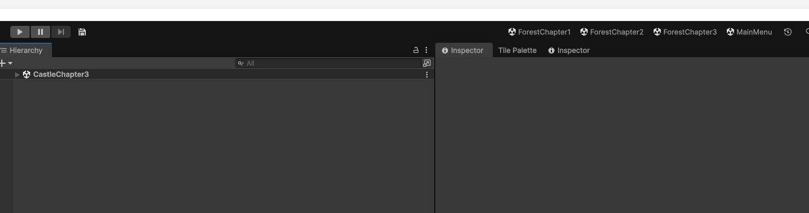
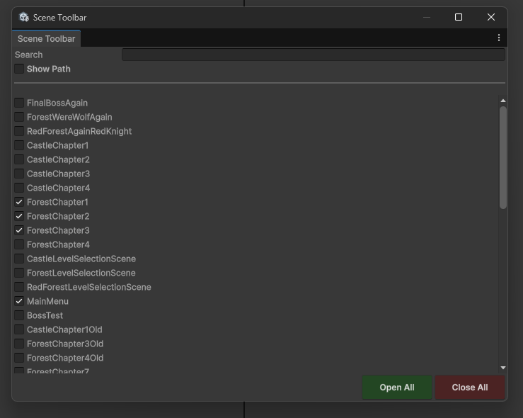
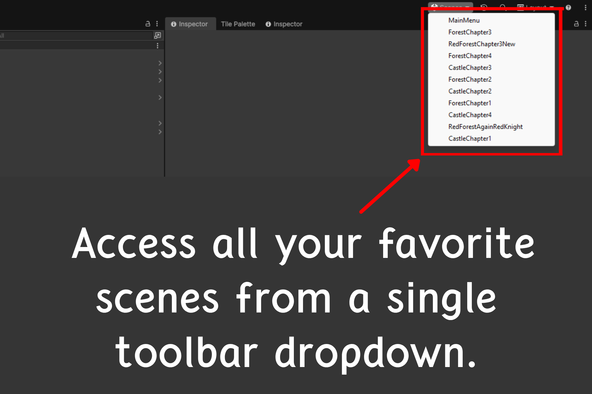

# Scene Switcher Bar
A lightweight Unity editor extension that adds **quick scene-switch buttons** to the main editor toolbar. You decide exactly which scenes show up, so the toolbar stays clean no matter how many scenes your project has.



## Requirements
- **Unity 6.3 or newer.** The tool uses the official `UnityEditor.Toolbars.MainToolbarElement` API, which was introduced in Unity 6.3. Earlier versions don't have a public API for the main toolbar.

## Installation
### Package Manager (Git URL)
Open **Window > Package Manager > + > Add package from git URL** and paste:
```
https://github.com/Alihan-4108/Scene-Switcher-Bar.git
```

## Usage
1. Open **Tools > Scene Toolbar Settings**.
   
2. Tick the scenes you want to see on the toolbar.
   - **Search** filters the list by name.
   - **Path** appends each scene's full asset path so you can tell duplicates apart.
   - **Open All / Close All** toggle every scene at once.
   - **Display** lets you switch between **Buttons** (each scene gets its own button) and **Dropdown** (all scenes grouped under one **Scenes** button).
     
3. The selected scenes show up on the right side of the main toolbar, either as separate buttons or under the Scenes dropdown depending on your Display setting. Click one to open that scene (you'll be asked to save first if there are unsaved changes).
